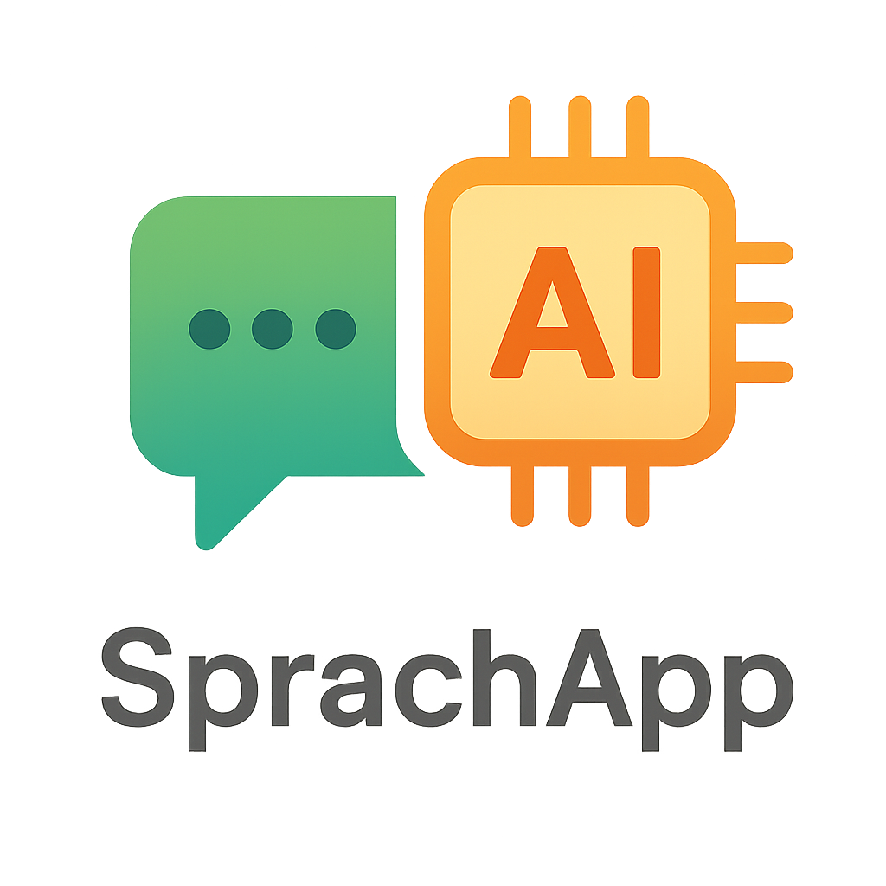

<p align="center">
  
</p>

# Sprachwelt – Deine KI-gestützte Sprachlernwelt 🌍✨


# TEASER:
Sprachwelt: Deine KI-gestützte Sprachlern-App
Tauche ein in eine neue Art des Sprachenlernens:

CEFR-basiertes Training (A1–C2)

Intelligente Drag-and-Drop Satzanalyse

Farbige Visualisierung der Satzstruktur

Live-Glossar und grammatikalische Erklärungen

Immersive Welten: Café, Hotel, Markt

KI-Avatare für realistische Konversation

Maximale Benutzerfreundlichkeit ohne Gender-Wirrwarr

Code first. Learning second. Spaß immer. 🚀

# Sprachwelt - Investor Story

Willkommen zur Investor Story von **Sprachwelt**, einer innovativen Sprachlernplattform, die mit KI-Unterstützung neue Maßstäbe setzt.

## Vision
Wir glauben daran, dass Sprache nicht nur aus Vokabeln und Grammatik besteht, sondern aus **Erleben**. Mit Sprachwelt wird das Lernen zu einer interaktiven Entdeckungsreise:
- **Drag & Drop** von Chat-Texten in Analysebereiche
- **Automatische Erkennung von Satzstrukturen** (Subjekt, Verb, Artikel etc.)
- **Farbliche Markierung und Sofort-Feedback**
- **Intelligente Erkennung von Präpositionen** (einfach, zusammengesetzt, speziell)
- **Popup-Erklärungen** mit kulturellem Kontext, Grammatik, CEFR-Level und Video-Verlinkung

## Warum Sprachwelt?
### 1. Sprachlernen neu gedacht
Sprachwelt bietet eine immersive, intuitive Oberfläche, die sofortige Erkenntnisse liefert und durch Farben und Popups das Lernen emotionalisiert.

### 2. KI-Unterstützung auf hohem Niveau
- Erkennung und Analyse von Satzteilen
- CEFR-Niveau-abhängige Textanalyse
- Sanfte Begleitung durch Erklärungen, Tipps und kulturelle Hinweise

### 3. Für moderne Lerner
- **Kein erzwungenes Gendern**, sondern kultursensibles Sprachlernen
- **Smooth User Experience** mit weichem Scrollen, Drag & Drop, dynamischen Popups
- Flexibel erweiterbares Dictionary-System

## Technische Highlights
- **Next.js**-basierte App mit modularen Komponenten
- **React Hooks** für dynamische Interaktionen
- **TailwindCSS** für modernes, responsives Design
- **Progressives Rendering** für Sofortfeedback auch bei großen Texten

## Features im Detail
- Automatisches Scrollen in der Chat-Historie
- Farblich codierte Satzanalyse
- Split der Präpositionen je nach Level (A1, A2, B1...)
- Popups mit Bedeutungen, grammatikalischer Einordnung und Kulturinfos
- Smooth Drag & Drop Funktionalität für Chattexte

## Next Steps
- Ausbau der CEFR-Level-gestützten Grammatikannotationen
- Einführung smarter Quizfunktionen basierend auf Fehleranalyse
- Community-Features (Peer-to-Peer-Sprachtraining)
- Mobile App Version (PWA)

## Unser Ziel
**Sprachwelt** wird DIE Plattform für modernes, immersives, kulturell intelligentes Sprachlernen - für Erwachsene, Professionals und Bildungseinrichtungen.

---

> **Bereit, die Sprachwelt zu erobern?**

**Let's build the future of language learning. Together.** 🌍🚀


This is a [Next.js](https://nextjs.org) project bootstrapped with [`create-next-app`](https://github.com/vercel/next.js/tree/canary/packages/create-next-app).

## Getting Started

First, run the development server:

```bash
npm run dev
# or
yarn dev
# or
pnpm dev
# or
bun dev
```

Open [http://localhost:3000](http://localhost:3000) with your browser to see the result.

as test texts you can use: 
- Il ragazzo mangia una pizza calda in un ristorante italiano.“
- Lei ordina una pizza calda in un ristorante italiano.“
- „Il barista prepara un caffè veloce per il cliente.“
- „La signora compra dei fiori freschi al mercato.“


You can start editing the page by modifying `app/page.js`. The page auto-updates as you edit the file.

This project uses [`next/font`](https://nextjs.org/docs/app/building-your-application/optimizing/fonts) to automatically optimize and load [Geist](https://vercel.com/font), a new font family for Vercel.

## Learn More

To learn more about Next.js, take a look at the following resources:

- [Next.js Documentation](https://nextjs.org/docs) - learn about Next.js features and API.
- [Learn Next.js](https://nextjs.org/learn) - an interactive Next.js tutorial.

You can check out [the Next.js GitHub repository](https://github.com/vercel/next.js) - your feedback and contributions are welcome!

## Deploy on Vercel

The easiest way to deploy your Next.js app is to use the [Vercel Platform](https://vercel.com/new?utm_medium=default-template&filter=next.js&utm_source=create-next-app&utm_campaign=create-next-app-readme) from the creators of Next.js.

Check out our [Next.js deployment documentation](https://nextjs.org/docs/app/building-your-application/deploying) for more details.
